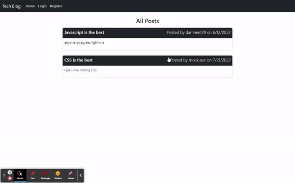

# tech-blog


## Description
A basic CMS style tech blog. Allows users to add posts with title and content. Also users can comment on other posts. Users have access to a dashboard where they can edit or delete existing post and add a new post. Technologies used: Express, node, handlebars, sequelize and MySQL


## Table of Contents
1. [Installation](#installation)
2. [Usage](#usage)
3. [License](#license)
4. [Contributing](#contributing)
5. [Tests](#tests)
6. [Questions](#questions)

## Installation
- To install the application locally please follow the instructions below.
```bash
- git clone git@github.com:daman29/tech-blog.git
- npm i
```
- Also make sure to seed demo data.
```bash
- npm run seed
```

## Usage
- Run the application with the following command:
```bash
- npm start
```
- Visit the application repository at [GitHub Repository](https://github.com/daman29/tech-blog)

- [Click on this link](https://tech-blog-damneet.herokuapp.com/) to visit the live application on Heroku.

The GIF below shows the basic functions of the application




## License
- This application is licensed under the [MIT License](./LICENSE)

## Contributing
- Clone repository first using git clone
- Contribute your changes to a new branch

## Tests
- No test commands

## Questions
- Reach me via email at damneet.sambhy@hotmail.com or issues on [github](https://github.com/daman29)